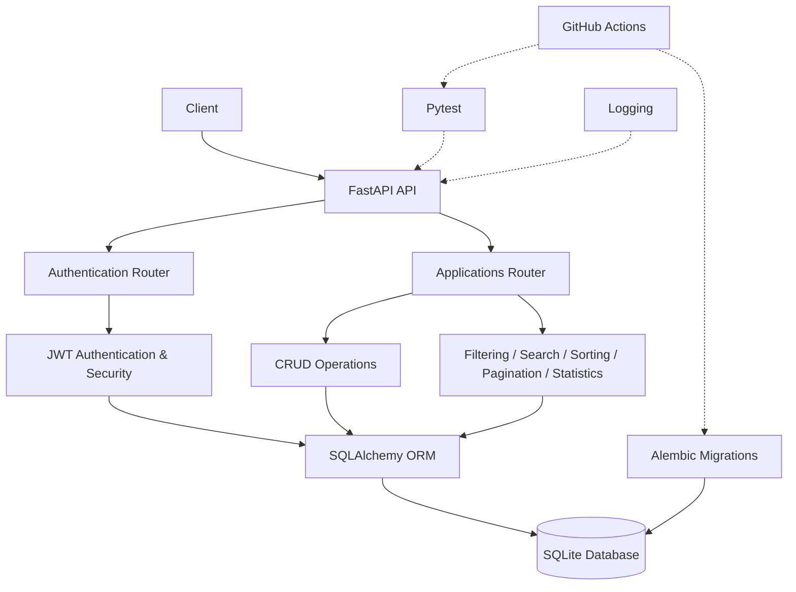

# 🚀 Job Tracker API

A backend REST API for managing job applications, built with **FastAPI** and **SQLAlchemy**.

The project includes authentication, CRUD operations, filtering, search, sorting, pagination, application statistics, database migrations, automated testing, logging, and GitHub Actions CI.

---

## ✨ Features

### 🔐 Authentication

* User registration and login
* JWT access tokens
* Refresh token support
* Logout with refresh-token revocation
* Password hashing using bcrypt
* Protected application APIs

### 💼 Job Applications

* Create, read, update, and delete applications
* User-specific application data
* Application status management:

  * `Applied`
  * `Interview`
  * `Rejected`
  * `Offer`

### 🔎 Application Management

* Filter by status, company, and role
* Search by company or role
* Sort by ID, company, role, status, or creation date
* Pagination using page and limit
* Combine filters, search, sorting, and pagination

### 📊 Statistics

* Total number of applications
* Application count by status
* Application count by company

### 🧪 Testing & Quality

* Automated tests with Pytest
* Authentication and application API testing
* Input validation using Pydantic
* Custom exception handling
* Global error handling
* Database migration validation

### ⚙️ Engineering Practices

* SQLAlchemy ORM
* Alembic database migrations
* Environment-based configuration
* Structured logging
* GitHub Actions CI
* Clean project structure
* API documentation with Swagger UI

---

## 🛠️ Tech Stack

| Technology     | Purpose                     |
| -------------- | --------------------------- |
| Python         | Programming language        |
| FastAPI        | Backend framework           |
| Uvicorn        | ASGI server                 |
| SQLAlchemy     | ORM                         |
| SQLite         | Database                    |
| Pydantic       | Request/response validation |
| JWT            | Authentication              |
| bcrypt         | Password hashing            |
| Alembic        | Database migrations         |
| Pytest         | Automated testing           |
| HTTPX          | API testing                 |
| GitHub Actions | CI                          |

---

## 📁 Project Structure

```text
job-tracker-api/
│
├── app/
│   ├── __init__.py
│   ├── config.py
│   ├── database.py
│   ├── exceptions.py
│   ├── logging_config.py
│   ├── main.py
│   ├── models.py
│   ├── schemas.py
│   ├── security.py
│   │
│   └── routers/
│       ├── applications.py
│       └── auth.py
│
├── tests/
│   ├── conftest.py
│   └── test_auth.py
│
├── alembic/
│   ├── versions/
│   └── env.py
│
├── .github/
│   └── workflows/
│       └── ci.yml
│
├── .env.example
├── .gitignore
├── alembic.ini
├── requirements.txt
└── README.md
```

---

## 🔐 Authentication Flow

The API uses JWT-based authentication.

```text
Register
   ↓
Login
   ↓
Access Token + Refresh Token
   ↓
Access protected APIs
   ↓
Access Token expires
   ↓
Refresh Token
   ↓
New Access Token
```

Protected application endpoints require:

```http
Authorization: Bearer <access_token>
```

Refresh tokens can also be revoked during logout.

---

## 📡 API Endpoints

### Authentication

| Method | Endpoint         | Description                 |
| ------ | ---------------- | --------------------------- |
| POST   | `/auth/register` | Register a new user         |
| POST   | `/auth/login`    | Login and receive tokens    |
| POST   | `/auth/refresh`  | Generate a new access token |
| POST   | `/auth/logout`   | Revoke refresh token        |

### Applications

| Method | Endpoint              | Description                |
| ------ | --------------------- | -------------------------- |
| POST   | `/applications`       | Create application         |
| GET    | `/applications`       | Get applications           |
| GET    | `/applications/stats` | Get application statistics |
| GET    | `/applications/{id}`  | Get application by ID      |
| PUT    | `/applications/{id}`  | Update application         |
| DELETE | `/applications/{id}`  | Delete application         |

---

## 🔎 API Examples

### Get Applications

Basic request:

```http
GET /applications
Authorization: Bearer <access_token>
```

With pagination:

```http
GET /applications?page=1&limit=10
Authorization: Bearer <access_token>
```

With filtering:

```http
GET /applications?status=Interview&company=Google
Authorization: Bearer <access_token>
```

With search:

```http
GET /applications?search=software
Authorization: Bearer <access_token>
```

With sorting:

```http
GET /applications?sort_by=created_at&order=desc
Authorization: Bearer <access_token>
```

Filters, search, sorting, and pagination can also be combined.

---

## 📊 Application Statistics

```http
GET /applications/stats
Authorization: Bearer <access_token>
```

Example response:

```json
{
  "total_applications": 12,
  "status_counts": {
    "Applied": 5,
    "Interview": 4,
    "Rejected": 2,
    "Offer": 1
  },
  "company_counts": {
    "Google": 3,
    "Microsoft": 2,
    "Amazon": 2
  }
}
```

---

## 🧪 Running Tests

Install the dependencies:

```bash
pip install -r requirements.txt
```

Run the test suite:

```bash
python -m pytest
```

The project uses **Pytest** and **HTTPX** for automated API testing.

---

## 🗄️ Database Migrations

The project uses **Alembic** for database schema migrations.

Apply migrations:

```bash
alembic upgrade head
```

Check migration status:

```bash
alembic current
```

Verify that migrations are up to date:

```bash
alembic check
```

Create a new migration after a model change:

```bash
alembic revision --autogenerate -m "describe change"
```

---

## ▶️ Run Locally

### 1. Clone the repository

```bash
git clone https://github.com/prernasharma28/Job-tracker-api.git
cd Job-tracker-api
```

### 2. Create a virtual environment

Windows:

```powershell
python -m venv venv
venv\Scripts\activate
```

### 3. Install dependencies

```bash
pip install -r requirements.txt
```

### 4. Configure environment variables

Create a `.env` file based on `.env.example`.

Example:

```env
DATABASE_URL=sqlite:///./job_tracker.db
SECRET_KEY=your-secret-key
ALGORITHM=HS256
ACCESS_TOKEN_EXPIRE_MINUTES=30
REFRESH_TOKEN_EXPIRE_DAYS=7
```

> Never commit the `.env` file or real secrets to GitHub.

### 5. Apply database migrations

```bash
alembic upgrade head
```

### 6. Start the API

```bash
uvicorn app.main:app --reload
```

The API will be available at:

```text
http://127.0.0.1:8000
```

---

## 📖 API Documentation

FastAPI automatically provides interactive API documentation.

### Swagger UI

```text
http://127.0.0.1:8000/docs
```

### ReDoc

```text
http://127.0.0.1:8000/redoc
```

Swagger UI can be used to test the API endpoints directly.

---

## 🔄 GitHub Actions

The project uses GitHub Actions for continuous integration.

The CI workflow:

```text
Push / Pull Request
        ↓
Install dependencies
        ↓
Apply database migrations
        ↓
Run Pytest
        ↓
Check Alembic migrations
```

Workflow file:

```text
.github/workflows/ci.yml
```

The CI pipeline runs automatically for pushes and pull requests targeting `main`.

---

## 📝 Environment Variables

The application configuration is controlled through environment variables.

| Variable                      | Description             |
| ----------------------------- | ----------------------- |
| `DATABASE_URL`                | Database connection URL |
| `SECRET_KEY`                  | JWT signing secret      |
| `ALGORITHM`                   | JWT algorithm           |
| `ACCESS_TOKEN_EXPIRE_MINUTES` | Access token expiry     |
| `REFRESH_TOKEN_EXPIRE_DAYS`   | Refresh token expiry    |

For local development, use `.env`.

For CI, required values are provided through GitHub Actions environment configuration.

---

## 🏗️ Architecture



### Request Flow

```text
Client
  ↓
FastAPI Router
  ↓
Validation / Authentication
  ↓
Business Logic
  ↓
SQLAlchemy ORM
  ↓
SQLite
```

---

## 📌 What This Project Demonstrates

This project was built to practice and demonstrate practical backend engineering concepts:

* REST API development
* FastAPI
* Python backend development
* Authentication and authorization
* JWT access and refresh tokens
* Password hashing
* CRUD operations
* SQLAlchemy ORM
* Database design
* Database migrations
* Input validation
* Filtering and searching
* Sorting
* Pagination
* Aggregation and statistics
* Exception handling
* Automated testing
* Logging
* Environment-based configuration
* CI with GitHub Actions
* Clean project organization

---

## 🚀 Future Improvements

Possible future enhancements include:

* PostgreSQL
* Redis caching
* Background jobs
* Rate limiting
* Email notifications
* Advanced analytics
* Cloud deployment
* Horizontal scaling

These are potential extensions for learning and scalability rather than requirements of the current project.

---

## 👩‍💻 Author

**Prerna Sharma**

Software Engineer | Problem Solving

GitHub:
https://github.com/prernasharma28
