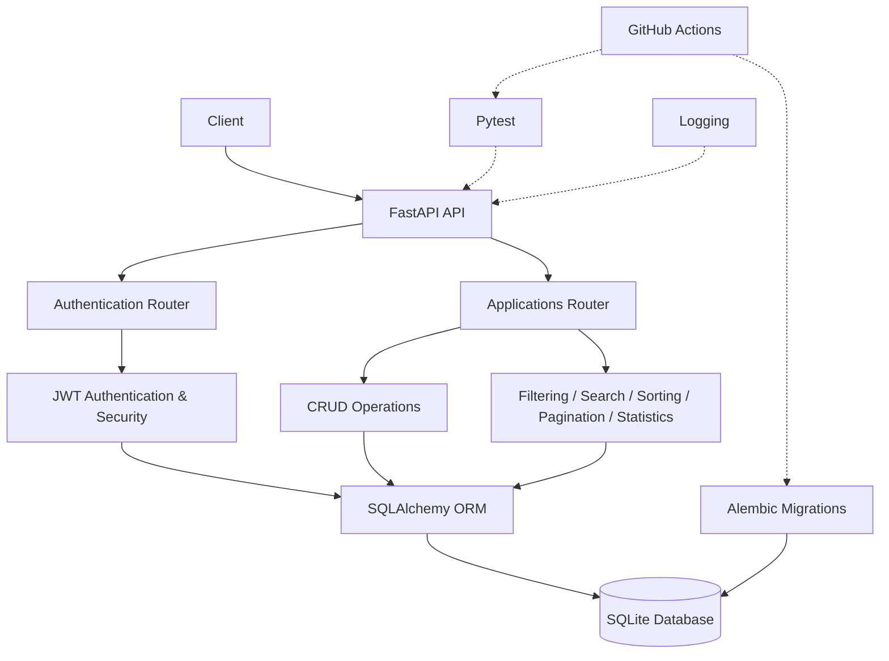

# Job Tracker API

A RESTful backend API for managing and tracking job applications, built with **FastAPI** and **SQLAlchemy**.

The project includes user authentication, JWT access and refresh tokens, CRUD operations, filtering, search, sorting, pagination, application statistics, validation, database migrations, automated testing, logging, and GitHub Actions CI.

---

## 🚀 Features

### 🔐 Authentication

* User registration and login
* Password hashing with bcrypt
* JWT-based authentication
* Access and refresh tokens
* Refresh token validation and revocation
* Logout functionality
* Protected application endpoints

### 💼 Job Application Management

* Create job applications
* View applications
* View a specific application
* Update applications
* Delete applications
* User-specific application data

### 🔎 Filtering, Search & Sorting

* Filter by application status
* Filter by company
* Filter by role
* Search by company or role
* Sort by:

  * ID
  * Company
  * Role
  * Status
  * Created date
* Ascending and descending ordering

### 📄 Pagination

* Page-based pagination
* Configurable page size
* Maximum limit validation

### 📊 Application Statistics

* Total number of applications
* Application count by status
* Application count by company

### 🛡️ Validation & Error Handling

* Request validation with Pydantic
* Email validation
* Password length validation
* Application field validation
* Custom application-not-found handling
* Global exception handling
* Appropriate HTTP status codes

### 🗄️ Database & Migrations

* SQLite database
* SQLAlchemy ORM
* Alembic database migrations
* Migration consistency checks

### 🧪 Testing

* Automated tests with pytest
* Authentication test coverage
* Test database configuration

### 📋 Logging

* Request and response logging
* Application creation, update, and deletion logs
* Authentication event logging
* Failed login logging
* Unexpected error logging

### ⚙️ CI

GitHub Actions automatically:

* Installs project dependencies
* Applies database migrations
* Runs the test suite
* Checks Alembic migration consistency

---

## 🛠️ Tech Stack

| Technology     | Purpose                    |
| -------------- | -------------------------- |
| Python         | Programming language       |
| FastAPI        | Web framework              |
| SQLAlchemy     | ORM / database interaction |
| SQLite         | Database                   |
| Pydantic       | Data validation            |
| JWT            | Authentication             |
| bcrypt         | Password hashing           |
| Alembic        | Database migrations        |
| pytest         | Testing                    |
| GitHub Actions | CI                         |
| Uvicorn        | ASGI server                |

---

## 📁 Project Structure

```text
job-tracker-api/
│
├── app/
│   ├── __init__.py
│   ├── config.py
│   ├── database.py
│   ├── exceptions.py
│   ├── logging_config.py
│   ├── main.py
│   ├── models.py
│   ├── schemas.py
│   ├── security.py
│   │
│   └── routers/
│       ├── applications.py
│       └── auth.py
│
├── tests/
│   ├── conftest.py
│   └── test_auth.py
│
├── alembic/
│   ├── versions/
│   └── env.py
│
├── .github/
│   └── workflows/
│       └── ci.yml
│
├── .env.example
├── .gitignore
├── alembic.ini
├── requirements.txt
└── README.md
```

---

## 🔑 Authentication Flow

The API uses JWT-based authentication.

```text
Register
   ↓
Login
   ↓
Access Token + Refresh Token
   ↓
Access Token
   ↓
Protected API Endpoints
```

When the access token expires:

```text
Refresh Token
      ↓
POST /auth/refresh
      ↓
New Access Token
```

Refresh tokens are stored in the database and can be revoked during logout.

---

## 🔌 API Endpoints

### Authentication

| Method | Endpoint         | Description                 |
| ------ | ---------------- | --------------------------- |
| POST   | `/auth/register` | Register a new user         |
| POST   | `/auth/login`    | Login                       |
| POST   | `/auth/refresh`  | Generate a new access token |
| POST   | `/auth/logout`   | Revoke refresh token        |

### Applications

| Method | Endpoint              | Description                |
| ------ | --------------------- | -------------------------- |
| POST   | `/applications`       | Create an application      |
| GET    | `/applications`       | Get applications           |
| GET    | `/applications/stats` | Get application statistics |
| GET    | `/applications/{id}`  | Get one application        |
| PUT    | `/applications/{id}`  | Update an application      |
| DELETE | `/applications/{id}`  | Delete an application      |

---

## 🔎 Example: Get Applications

Basic request:

```http
GET /applications

Authorization: Bearer <access_token>
```

With pagination:

```http
GET /applications?page=1&limit=10

Authorization: Bearer <access_token>
```

With filtering:

```http
GET /applications?status=Interview&company=Google

Authorization: Bearer <access_token>
```

With search:

```http
GET /applications?search=software

Authorization: Bearer <access_token>
```

With sorting:

```http
GET /applications?sort_by=created_at&order=desc

Authorization: Bearer <access_token>
```

Filters, search, sorting, and pagination can also be combined.

---

## 📊 Example: Application Statistics

```http
GET /applications/stats

Authorization: Bearer <access_token>
```

Example response:

```json
{
  "total_applications": 12,
  "status_counts": {
    "Applied": 5,
    "Interview": 4,
    "Rejected": 2,
    "Offer": 1
  },
  "company_counts": {
    "Google": 3,
    "Microsoft": 2,
    "Amazon": 2
  }
}
```

---

## 🧪 Running Tests

Install the project dependencies:

```bash
pip install -r requirements.txt
```

Set the required environment variable:

### PowerShell

```powershell
$env:SECRET_KEY="your-test-secret-key"
```

Run the test suite:

```bash
python -m pytest
```

For a shorter output:

```bash
python -m pytest -q
```

---

## 🗄️ Database Migrations

Apply all migrations:

```bash
alembic upgrade head
```

Check whether the database schema is up to date:

```bash
alembic check
```

View the current migration:

```bash
alembic current
```

---

## ▶️ Running the API Locally

Clone the repository and enter the project directory:

```bash
git clone https://github.com/prernasharma28/Job-tracker-api.git
cd Job-tracker-api
```

Create and activate a virtual environment:

### Windows PowerShell

```powershell
python -m venv venv

.\venv\Scripts\Activate.ps1
```

Install dependencies:

```powershell
pip install -r requirements.txt
```

Create a `.env` file based on `.env.example` and configure your secret key.

Run the database migrations:

```powershell
alembic upgrade head
```

Start the API:

```powershell
uvicorn app.main:app --reload
```

The API will be available at:

```text
http://127.0.0.1:8000
```

---

## 📚 API Documentation

FastAPI automatically provides interactive API documentation.

### Swagger UI

```text
http://127.0.0.1:8000/docs
```

### ReDoc

```text
http://127.0.0.1:8000/redoc
```

Swagger UI can be used to explore endpoints and test API requests directly from the browser.

---

## ⚙️ GitHub Actions

The project uses GitHub Actions for continuous integration.

On pushes to `main` and pull requests targeting `main`, the workflow:

```text
Checkout code
      ↓
Set up Python
      ↓
Install dependencies
      ↓
Run database migrations
      ↓
Run tests
      ↓
Check migrations
```

This helps ensure that changes do not break the application or database migration state.

---

## 🔒 Environment Variables

The application uses environment variables for configuration.

Example:

```env
DATABASE_URL=sqlite:///./job_tracker.db
SECRET_KEY=your-secret-key
JWT_ALGORITHM=HS256
ACCESS_TOKEN_EXPIRE_MINUTES=30
REFRESH_TOKEN_EXPIRE_DAYS=7
```

**Never commit your actual `.env` file or production secrets to GitHub.**

Use `.env.example` as a template.

---

## 🏗️ Architecture

The main application flow is:



The application is organized into separate layers for:

* API routing
* Request/response schemas
* Database models
* Authentication and security
* Database configuration
* Error handling
* Logging

---

## 📈 What This Project Demonstrates

This project demonstrates practical backend development skills including:

* REST API development
* FastAPI
* Authentication and authorization
* JWT access and refresh tokens
* SQLAlchemy ORM
* Database design
* CRUD operations
* Filtering and search
* Sorting and pagination
* Input validation
* Exception handling
* Database migrations
* Automated testing
* Logging
* Continuous integration
* Git and GitHub workflow

---

## 🔮 Future Improvements

Potential future improvements include:

* PostgreSQL for production-scale relational storage
* Redis-based caching
* Background job processing
* Rate limiting
* Advanced monitoring
* Containerization
* Cloud deployment

These are intentionally kept outside the current project scope.

---

## 👩‍💻 Author

**Prerna Sharma**

Software Engineer | Problem Solving

GitHub:

https://github.com/prernasharma28
